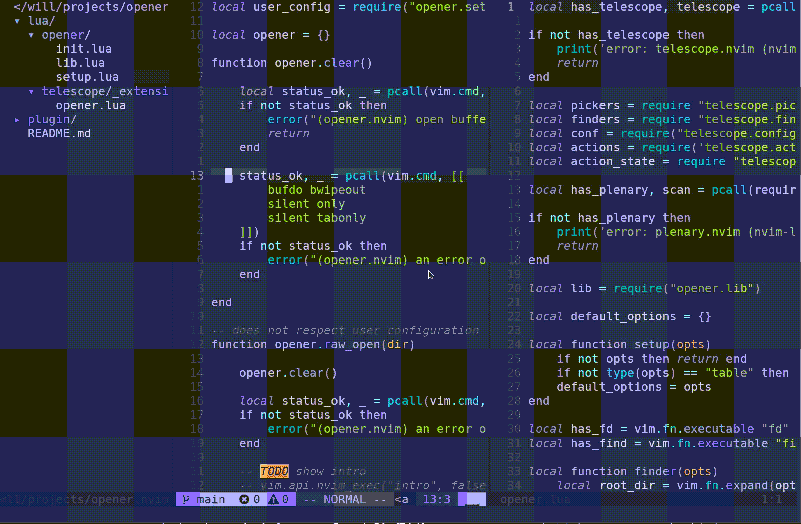

# opener.nvim

A workspace/context switcher for neovim. It allows you to **open directories / folders** and reset the neovim instance (like in vscode and other editors). This is especially useful for neovim-GUI's such as [neovide](https://github.com/neovide/neovide), which you may not want to restart.

For quick questions feel free to ask on [reddit](https://www.reddit.com/r/neovim/comments/sp4bva/my_first_neovim_plugin_openernvim_quickly_open/).



## 📦 Installation
[Telescope](https://github.com/nvim-telescope/telescope.nvim) is an optional, but a recommended dependency. I also recommend installing [fd](https://github.com/sharkdp/fd), but it is not required.

[Packer](https://github.com/wbthomason/packer.nvim):
```lua
use "willthbill/opener.nvim"
```

[vim-plug](https://github.com/junegunn/vim-plug):
```viml
Plug 'willthbill/opener.nvim'
```

 You may want to pre-load the opener telescope extension.
```lua
require('telescope').load_extension("opener")
```

## 🚀 Usage
The following vim commands are available.
```viml
:Clear " Closes all buffers, tabs and windows, however it does not close unsaved buffers
:Open <directory> " Opens a directory and clears nvim
```
You can call the telescope extension like this.
```viml
:Telescope opener
:Telescope opener hidden=false respect_gitignore=true root_dir="~"
```
From lua you can call the extension like this.
#### **`lua`**
```lua
require('telescope').extensions.opener.opener()
require('telescope').extensions.opener.opener {
    hidden=false,
    respect_gitignore=true,
    root_dir="~",
}
```
`hidden` shows hidden files, `respect_gitignore` respects `.gitignore` files (`--no-ignore-vcs` `fd` flag), and `root-dir` is the directory to list subdirectories from.

## ⚙️  Configuration
### Hooks
You can call the `opener.setup` function to configure opener.nvim.
#### **`lua`**
```lua
require('opener').setup {
    pre_open = {}
    post_open = {}
}
```
`pre_open` and `post_open` are strings (vim-commands) or functions (lua functions) or tables/lists of strings/functions. lua functions will be given an argument, which is the directory, which will be/was changed to.

All commands/functions in `pre_open` are called before the `cwd` (current working directory) is changed by `:Open` or the `Telescope` extension.

All commands/functions in `post_open` are called after the `cwd` (current working directory) is changed by `:Open` or the `Telescope` extension.

### Telescope extension default values
When you set up `telescope` you may specify default values for the arguments for the opener extension.
#### **`lua`**
```lua
require('telescope').setup {
    extensions = {
        opener = {
            hidden = false, -- do not show hidden directories
            root_dir = "~", -- search from home directory by default
            respect_gitignore = true, -- respect .gitignore files
        }
    }
}
```
### Keymaps
You may want to map the telescope extension to a keymap.
#### **`lua`**
```viml
vim.api.nvim_set_keymap("n", "<leader>o", ":Telescope opener<cr>", { noremap = true, silent = true })
```
#### **`vim script`**
```viml
nnoremap <leader>o :Telescope opener<cr>
```

## ⚡ Example setup
The following is an example setup of opener.nvim.
#### **`~/.config/nvim/init.lua`**
```lua
... -- packer setup
    use {
        "~/projects/opener.nvim",
        config = function()
            require('telescope').load_extension("opener")
        end
    }
...
require('telescope').setup {
    ...
    extensions = {
        opener = {
            hidden = false, -- do not show hidden directories
            root_dir = "~", -- search from home directory by default
            respect_gitignore = true, -- respect .gitignore files
        }
    }
}
...
require('opener').setup {
    pre_open = function(new_dir)
        print("Yay, opening " .. new_dir .. " in a moment")
    end
    post_open = { "NERDTree", function(new_dir)
        print(new_dir .. " was opened")
    end}
}
```
